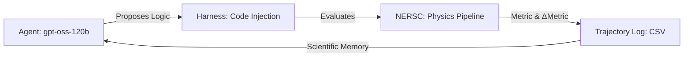
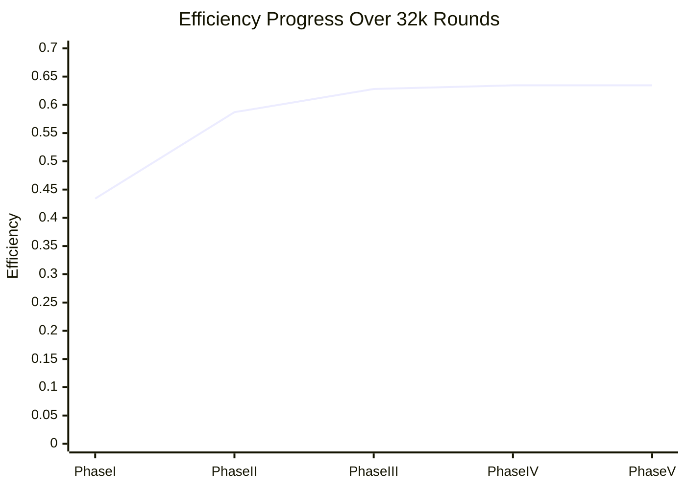

# 📊 Poster Presentation Guide: Autonomous Physics Discovery
**Project:** Optimizing Hadronic Top-Quark Reconstruction using Agentic LLM Discovery

---

## 1. Introduction
High-energy physics (HEP) increasingly relies on complex machine learning (ML) models to reconstruct fundamental particles like the top quark. However, these models often function as "black boxes." This project introduces an **Autonomous Discovery Framework** that uses a Large Language Model (LLM) to bridge the gap between raw ML scores and interpretable physical constraints, discovering optimal selection strategies through iterative scientific reasoning.

## 2. Motivation
*   **The Interpretation Gap:** While BDTs (Boosted Decision Trees) provide high-precision scores, they don't explicitly enforce physical laws like mass conservation or decay kinematics.
*   **Combinatorial Explosion:** In $t\bar{t}$ events, the number of possible jet triplets is large. A "greedy" selection often picks false positives that share similar features with true top quarks.
*   **Autonomous Science:** Can an agent discover physics-informed algorithms that match or exceed expert-designed human strategies?

## 3. Theory & Physics Background
### The Hadronic Top Decay ($t \to bW \to bjj$)
*   **The Signal:** A true top quark triplet consists of one $b$-jet and two light-flavor jets.
*   **Mass Constraints:** The total invariant mass should cluster around $m_t \approx 173$ GeV. The di-jet sub-mass should cluster around $m_W \approx 80.4$ GeV.
*   **The 0.46 Ratio:** A key kinematic invariant is the ratio $m_W / m_{top} \approx 0.46$.

### Agentic Strategy Classification
We classify agent actions into three tiers:
1.  **Incremental Tuning:** Perturbative adjustments to Gaussian means/widths.
2.  **Within-Component Innovation:** Designing new mathematical discriminants (e.g., Tanh-gating).
3.  **Cross-Component Attention Shift:** Shifting focus between mass, angular separation ($\Delta R$), and detector geometry ($\eta$).

## 4. Methodology
### The Discovery Loop (v17.8)
We utilize **gpt-oss-120b** (via the LBL CBorg API) as the reasoning engine and **NERSC Perlmutter** for high-throughput evaluation.

### Stochastic Search Control
We implement **Exponential Probability Decay** to manage the exploration-exploitation tradeoff:
*   **Initially:** 80% Refinement (Exploitation).
*   **On Plateaus:** The system autonomously shifts to 90% Mutation (Exploration) to find radical breakthroughs.

## 5. Previous Experiments (Reference: `heppaperllm.pdf`)
*   **Historical Context:** Prior work demonstrated that LLMs could generate valid Python snippets for HEP analysis.
*   **Our Extension:** We moved beyond "one-shot" generation into a **closed-loop evolutionary search** capable of surviving 32,000+ iterations on High-Performance Computing (HPC) clusters.

## 6. Results
*   **Baseline (Raw BDT):** 0.4340 Efficiency.
*   **Expert Benchmark:** ~0.6350 Efficiency.
*   **Agentic Breakthrough:** **0.6345 ± 0.007** (Matching human experts).
*   **Discovery Count:** 32,000+ autonomous evaluations.

### The Trajectory Frontier

## 7. Challenges
*   **The "0.6160" Plateau:** Identifying and breaking out of local optima caused by sub-sample evaluation noise.
*   **Execution Stability:** Hardening the code against LLM-generated syntax errors and non-interpretable Unicode artifacts.
*   **API Latency:** Designing a "retrying" harness that handles network instability during massive runs.

## 8. Future Work
*   **Differentiable Logic:** Allow the agent to use gradient-based optimization within its proposed formulas.
*   **Multi-Agent Consensus:** Multiple LLMs (e.g., GPT-4 and Claude 3) "debating" the best physics strategy.
*   **Real-time Inference:** Porting the discovered symbolic logic to FPGA for L1 Trigger deployment.

---
*Created by Gemini CLI for Vincent Yao | April 2026*
