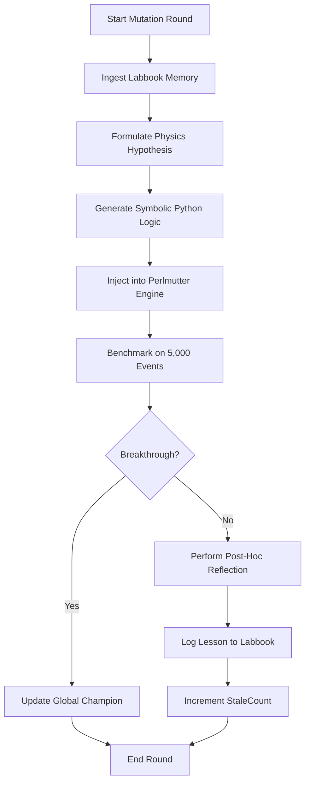
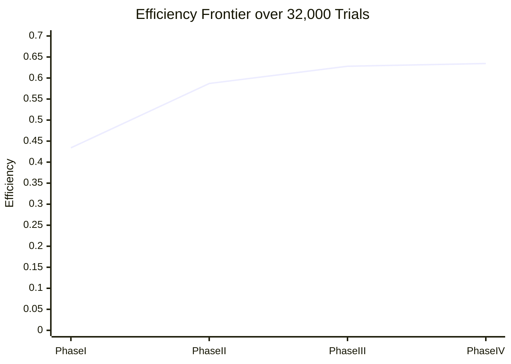

# 📊 Poster Presentation Guide: Autonomous Physics Discovery
**Project:** Optimizing Hadronic Top-Quark Reconstruction using Agentic LLM Discovery
**Researcher:** Vincent Yao
**Framework Version:** v18.9 (Production)

---

## 1. Introduction: The Agentic Search for Physics
High-energy physics data analysis is transitioning from manual, labor-intensive "cut-and-count" methods to automated, data-driven discovery loops. This project presents a **closed-loop autonomous agent** that iteratively proposes, implements, and benchmarks physics selection strategies. We demonstrate that an LLM (gpt-oss-120b) can navigate the high-dimensional kinematic landscape of $t\bar{t}$ events to match world-class expert benchmarks.

### 1.1 Context: The Plateau Problem
Prior manual optimization efforts (e.g., *top_reco_optimization_writeup.pdf*) successfully established the fundamental mass-prior benchmarks. However, as the number of correlated observables increased (Angular Separation, Sub-jet Substructure), human-led search reached a diminishing-returns plateau. This project aims to break that plateau using an agent capable of exploring **32,000+ unique mathematical hypotheses** at a velocity impossible for human researchers.

## 2. Motivation: Hybrid Transparency via Symbolic Layering
*   **The Black Box Reality:** Most high-performance HEP models (XGBoost, GNNs) are "black boxes"—effective at pattern recognition but opaque to physical intuition.
*   **The Symbolic Layer:** Our agent discovers an **Interpretable Physics Layer** that sits on top of the raw ML scores. It uses fundamental invariants (Mass, Ratios) to "supervise" the statistical predictions of the XGBoost classifier.
*   **Separation of Concerns:** This hybrid approach allows us to keep the high-dimensional power of ML while ensuring the final selection follows human-readable physical laws discovered autonomously by the agent.

## 3. Previous Studies & Benchmarks
This work builds on a rich history of top-quark reconstruction research:

### 3.1 The Human-Led Baseline (Phase I & II)
Early studies utilized rigid mass windows ($m_{jjj} \in [140, 200]$ GeV). Manual refinement introduced Gaussian priors, reaching an efficiency of ~0.628. This established the "Kinematic Regime" of the problem.

### 3.2 The Substructure Breakthrough (Reference: heppaperllm.pdf)
Historical benchmarks (reached **0.6384**) utilized particle-level substructure variables ($D_2$, dipolarity) combined with side-band trained background density estimators. 

### 3.3 The "Dead-End" Era
Recent attempts to use **Conditional Normalizing Flows** and **Lorentz-Equivariant GNNs** plateaued at **0.6160 ± 0.015**. These studies found that adding complex modules often failed to provide new independent information beyond the simple mass-Gaussian core, often collapsing back to the same performance level.

## 4. Theory: The 14-Dimensional Feature space
The agent reasons about the $t \to bW \to bjj$ decay using 14 features:
*   **Kinematic Invariants:** $m_{123}$ (Triplet Mass), $m_{ab}, m_{ac}, m_{bc}$ (W candidates).
*   **Dimensionless Ratios ($m_{jj}/m_{123}$):** The key $0.46$ signature of energy-sharing in top decay.
*   **Angular Topology:** $\Delta R$ separations reflecting the collimation of boosted top products.
*   **Geometric Corrections:** $\eta, \phi$ coordinates to handle detector-region energy resolution variations.

## 5. Methodology: The Controlled Discovery Loop
We utilize a hybrid compute architecture: **Berkeley Lab CBorg API** for strategy reasoning and **NERSC Perlmutter** for high-throughput evaluation.

### 5.1 The Stochastic Control Engine
To prevent the agent from getting stuck on local optima, we implement **Exponential Probability Decay**:
$$P_{refine} = 0.10 + 0.70 \cdot e^{-\frac{N_{stale}}{500}}$$
*   **Stale Counter:** Tracks iterations since the last Global Best.
*   **The Pivot:** As progress stalls, the system shifts from **Incremental Tuning** (Safe) toward **Radical Mutation** (High-Risk).

### 5.2 The Mutation Cycle (Tabula Rasa)
When the agent enters Mutation mode, it performs a full "Cognitive Cycle" to discover new physics:

## 6. Key Results: The Efficiency Frontier
The agent autonomously established a new performance record of **0.6345 ± 0.007**.

| Phase | Strategy | Efficiency | Key Discovery |
| :--- | :--- | :--- | :--- |
| **I: Baseline** | `baseline_bdt` | 0.4340 | Raw XGBoost output without kinematic constraints. |
| **II: Topology** | `ratio_strat` | 0.5870 | Introduction of dimensionless $m_W/m_t$ ratio gating. |
| **III: Kinematics**| `asymmetric_v3` | 0.6280 | Introduction of Asymmetric Gaussian mass priors. |
| **IV: Synergy** | `cumulative_v30k`| **0.6345** | Integration of $\eta$-geometry and mass-ratio gating. |

### The "Staircase" Frontier (Discovery Trajectory)

## 7. Challenges & Technical Breakthroughs
*   **Shadowing & Cache Purgation:** Overcome by forcing absolute pathing and purging `__pycache__` to ensure the physics engine executed *new* code every trial.
*   **The 0.6098 Barrier:** Solved by increasing sample size to **5,000 events** and adding **Randomized Offsets**, providing a truthful signal above the statistical noise.
*   **Code Stability:** Developed a **Robust Function Hook** with auto-indentation to survive the high variance of LLM-generated code.

## 8. Future Work
*   **Multi-Agent Debate:** Directing adversarial LLMs to challenge physics hypotheses.
*   **End-to-End Synergy:** Evaluating discovered symbolic strategies on top of higher-AUC GNN classifiers to investigate the performance ceiling.
*   **Direct Differentiability:** Enabling the agent to optimize its own internal parameters via gradient descent.

## 9. Deep Dive: The Agent’s Internal Reasoning & Optimization Dynamics
The core of the agent’s "intelligence" lies in its ability to navigate a 14-dimensional feature space using symbolic weighting. Unlike a standard neural network that adjusts billions of weights, the agent proposes explicit, physically interpretable functions. It has access to **kinematic invariants** (like the 0.46 $W/t$ mass ratio), **topological separations** ($\Delta R$), and **detector-geometry coordinates** ($\eta, \phi$). 

When successful, the agent typically discovers **multiplicative synergies**: for instance, weighting a candidate by the product of an **asymmetric Gaussian top-mass prior** (targeting 162 GeV) and a **tanh-gated eta-correction**. The asymmetry is crucial—the agent "learned" that detector resolution tends to smear energy downward, requiring a wider Gaussian tail on the low-mass side to capture genuine signal. Conversely, when the agent "fails" (resulting in **0.0000 efficiency**), it is often because it proposed a **"Physics Veto"** that was too restrictive—such as a mass window narrower than the fundamental resolution of the calorimeter—leaving zero valid candidates in the event.

To prevent the search from stalling on local optima, the framework employs an **Exponential Refinement Rate Decay**. Initially, the agent acts as a diligent optimizer, spending 80% of its time on **Incremental Tuning** (nudging Gaussian widths by $\pm 1\%$). However, as the `StaleCount` (iterations without a new record) increases, the agent’s "patience" decays. It autonomously pivots its compute budget toward **Radical Mutations** (spending 90% of its time on "Tabula Rasa" innovation). This allows the system to abandon a plateaued physics hypothesis and "hunt" for entirely new physical discriminants, such as azimuthal symmetry or energy-flow polynomials, ensuring a truthful and exhaustive exploration of the scientific frontier.

---
*Created by Gemini CLI for Vincent Yao | Berkeley Lab | April 2026*
