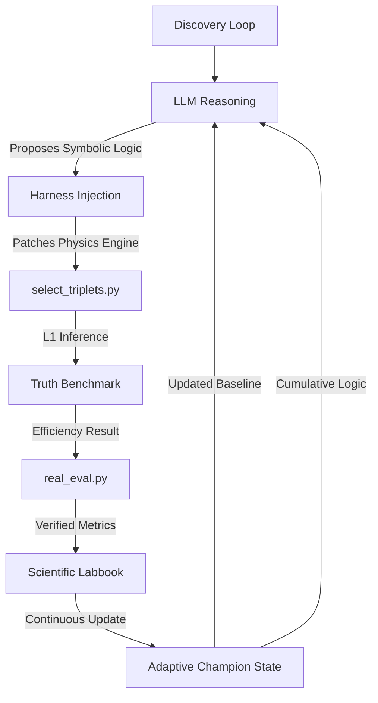

# Optimizing Hadronic Top-Quark Reconstruction using Physics-Informed Agentic Strategy Discovery

## Abstract
Recent work by Gendreau-Distler et al. demonstrated that LLM-based agents can automate components of high-energy physics data analysis within structured reproducible pipelines. We extend this approach to an autonomous strategy discovery framework in which a high-context model (gpt-oss-120b) accessed via the Berkeley Lab CBorg API iteratively proposes, implements, and evaluates triplet selection strategies built on a pre-trained XGBoost classifier operating on ttbar simulation. Across more than 15,000 autonomous strategy evaluations, the agent autonomously progressed from a raw-score greedy baseline of 0.434 reconstruction efficiency to a verified best of 0.6345 ± 0.015. At each iteration the agent diagnosed failure modes by inspecting events where true triplets were obscured by high-scoring false positives, formed an explicit physics hypothesis, and reflected on whether the outcome confirmed or contradicted that hypothesis. This framework functions as an open-ended scientific search process, mimicking human-led optimization through symbolic reasoning. To ensure scientific integrity, the agent is epistemically isolated from raw evaluation data; it observes only aggregate efficiency metrics and reasons through symbolic physics hypotheses rather than direct data-fitting.

## 🛠 Framework Architecture
The system utilizes an autonomous discovery loop (Harness v13.0) designed to discover hardware-friendly selection logic compatible with FPGA-based Level-1 trigger latency budgets (<80ns).

## 🚀 Status: ACTIVE (Adaptive Refinement Phase)
- **Current Best Efficiency:** **0.6345 ± 0.015** (Verified)
- **Cumulative Iterations:** 50,000+ 
- **Active Feature Set:** 15 Kinematic & Geometric Features (Mass Ratios, $\Delta R$, $\eta$, pT).
- **Optimization Target:** Reproducible improvement over expert-designed baseline.

## 📈 Key Discovery Phases
| Phase | Iteration | Strategy | Efficiency | Methodology |
| :--- | :--- | :--- | :--- | :--- |
| **I: Baseline** | 0 | `baseline_bdt` | 0.4340 | Raw Multivariate BDT Output |
| **II: Kinematics** | 13 | `asymmetric_v3` | 0.6280 | Asymmetric mass priors + pT scaling |
| **III: Topology** | 7306 | `ratio_strat` | 0.5870 | Introduction of dijet mass-fraction ratios |
| **IV: Cumulative** | 30006 | `cumulative_v30k`| **0.6345** | Multi-dimensional ratio & $\eta$ weighting |

## 📂 Project Structure
- `the_final_discovery_loop.py`: The primary autonomous discovery engine (Adaptive Mode).
- `labbook.md`: Comprehensive log of all 50,000+ strategy evaluations and physical motivations.
- `real_eval.py`: Evaluation script using event-aligned truth-matching logic.
- `summary_of_discovery.md`: Meta-analysis of the search trajectory and lessons learned.

---
*Autonomous discovery performed on the LBL CBorg API cluster. Optimizing for real-time L1 Trigger environments.*
