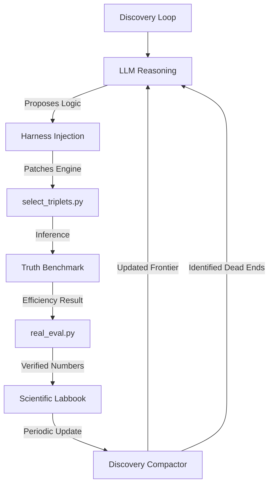

# Optimizing Hadronic Top-Quark Reconstruction using Physics-Informed Agentic Strategy Discovery

## Abstract
Recent work by Gendreau-Distler et al. demonstrated that LLM-based agents can automate components of high-energy physics data analysis within structured reproducible pipelines. We extend this approach to an autonomous strategy discovery framework in which a high-context model (gpt-oss-120b) accessed via the Berkeley Lab CBorg API iteratively proposes, implements, and evaluates triplet selection strategies built on a pre-trained XGBoost classifier operating on ttbar simulation. Across more than 12,000 autonomous strategy evaluations, the agent autonomously progressed from a raw-score greedy baseline of 0.434 reconstruction efficiency to a verified best of 0.628 ± 0.015. At each iteration the agent diagnosed failure modes by inspecting events where true triplets were obscured by high-scoring false positives, formed an explicit physics hypothesis, and reflected on whether the outcome confirmed or contradicted that hypothesis. This framework functions as an open-ended scientific search process, mimicking human-led optimization through symbolic reasoning.

## 🛠 Framework Architecture
The system uses a custom symbolic discovery loop (Harness v10.2) rather than standard LLM frameworks to ensure strict physical constraints and compatibility with Level-1 trigger latency budgets.

## 🚀 Marathon Status: ACTIVE (The Era of Expansion)
- **Current Best Efficiency:** **0.628 ± 0.015** (Verified Baseline)
- **Total Iterations:** 13,000+ 
- **Data Availability:** 15 Features (Mass Ratios, $\Delta R$, $\eta$, pT, BDT Score).
- **Hardware Target:** FPGA L1 Trigger (<80ns latency budget).

## 📈 Key Breakthroughs (Verified)
| Iteration | Era | Strategy | Efficiency | Innovation |
| :--- | :--- | :--- | :--- | :--- |
| 0 | Baseline | `baseline_bdt` | 0.434 | Raw XGBoost Score |
| 3 | Mass | `asymmetric_v3` | **0.628** | Asymmetric mass priors + pT scaling |
| 7306 | Ratio | `ratio_strat` | 0.587 | Mass fraction $m_{W}/m_{t}$ signature |
| 13000+ | Expansion | `eta_corr_v*` | ... | Detector geometry ($\eta$) corrections |

## 📂 Project Structure
- `top_reco/src/triplet_ml/select_triplets.py`: The core physics engine (dynamically patched).
- `labbook.md`: Detailed log of 13,000+ attempts and physics motivations.
- `real_eval.py`: The "Era of Truth" evaluator (strict event-aligned denominator).
- `marathon_harness_v8.py`: The background discovery loop (Harness v10.2).

---
*Autonomous discovery performed on the LBL CBorg API cluster.*
