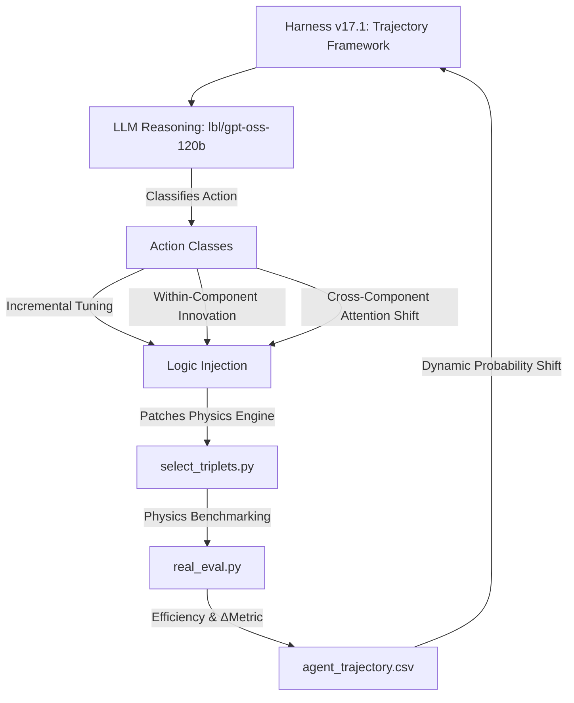

# Optimizing Hadronic Top-Quark Reconstruction using Physics-Informed Agentic Strategy Discovery

## 🔬 Project Overview
This project utilizes a custom autonomous discovery framework to optimize the reconstruction of hadronic top-quark decays ($t \to bW \to bjj$) in high-energy physics simulations. 

The primary challenge is **combinatorial background rejection**: in a multi-jet environment, the system must correctly identify which three jets originated from a single top quark. We prioritize **open-ended discovery**, allowing the agent to explore complex mathematical structures, multi-layer non-linear activations (MLP-style), and branching decision logic (BDT-style) to maximize reconstruction efficiency.

## 🛠 Framework Architecture (v17.1)
The system utilizes a "Hardened Physics Harness" (v17.1) featuring a **Trajectory Analysis Framework** and **Stochastic Exploration Control**.

## 🧠 Dynamic Search Control: Exploitation vs. Exploration
The core innovation of the v17.1 harness is the **Dynamic Refinement Rate**, which manages the trade-off between refining the current best strategy (Exploitation) and searching for radical new physics (Exploration).

### 1. Exponential Probability Decay
To prevent the agent from getting stuck on local performance plateaus, we implement an exponential decay function for the probability of selecting a "Refinement" action. As the number of iterations without a new champion (**Stale Iterations**) increases, the agent autonomously shifts its focus toward radical mutations.

$$P_{refine} = P_{floor} + (P_{initial} - P_{floor}) \cdot e^{-\frac{N_{stale}}{\tau}}$$

*   **Initial State**: 80% Refinement / 20% Mutation.
*   **Plateau Behavior**: If no improvement is found for 500 rounds ($\tau=500$), the probability of refinement drops to ~35%.
*   **Discovery Floor**: The rate floors at 10% ($P_{floor}=0.10$), ensuring that even in high-exploration mode, the agent still spends a small fraction of time "polishing" potential breakthroughs.

### 2. Action Classification System
The agent classifies every move into one of three literature-aligned categories:
*   **Incremental Tuning**: Small parameter tweaks (e.g., shifting a Gaussian mean by 1 GeV). These are favored when $P_{refine}$ is high.
*   **Within-Component Innovation**: New mathematical formulations for triplet scoring (e.g., switching from Gaussian to Tanh-based gating).
*   **Cross-Component Attention Shift**: Radical shifts in strategy, such as retraining the underlying classifier or changing the fundamental variable importance (e.g., prioritizing angular flow over mass consistency).

### 3. Local Refinement Branching (Promising Mutants)
If a radical mutation (Exploration) produces a result that is within **95% of the current champion**, the harness triggers a **Local Branch**. The system temporarily suspends the global search to perform 3–5 high-intensity refinement iterations on that specific "promising mutant" to see if it can be polished into a new Global Champion.

## 📊 Optimization Observables
The agent utilizes **14 distinct physics features** for every triplet candidate:
*   **Raw Classifier:** XGBoost BDT Score (Pre-trained on substructure).
*   **Global Triplet Scale:** Invariant Mass ($m_{123}$) and Transverse Momentum ($p_T$).
*   **Global Triplet Position:** Detector coordinates ($\eta, \phi$).
*   **Resonant Sub-Masses:** $m_{ab}, m_{ac}, m_{bc}$ (Individual jet-pair invariant masses).
*   **Dimensionless Mass Ratios:** $m_{ab}/m_{123}, m_{ac}/m_{123}, m_{bc}/m_{123}$ (Targeting the 0.46 $W/Top$ signature).
*   **Angular Topology:** $\Delta R_{ab}, \Delta R_{ac}, \Delta R_{bc}$ (Jet-pair angular separations).

## 📈 Scientific Discovery Timeline
The search has surpassed **32,000 unique strategy evaluations**:

| Phase | Goal | Breakthrough Strategy | Efficiency | Key Innovation |
| :--- | :--- | :--- | :--- | :--- |
| **I: Baseline** | Establish ML performance | `baseline_bdt` | 0.4340 | Pure BDT output without physics constraints. |
| **II: Kinematics** | Enforce Top resonance | `asymmetric_v3` | 0.6280 | Introduction of Asymmetric Gaussian mass priors. |
| **III: Topology** | Extract internal decay | `ratio_strat` | 0.5870 | Use of dimensionless ratios ($m_W/m_t$) to reject noise. |
| **IV: Cumulative** | Synergy & Refinement | `cumulative_v30k`| 0.6345 | Integration of $\eta$-position and ratio gating. |
| **V: Trajectory** | Search Space Mapping | `harness_v17.1` | **Active** | Formalized Action Classification & Stochastic Exploration. |

---
*Autonomous discovery performed on the LBL Perlmutter cluster. Aligned with literature for agentic scientific search.*
