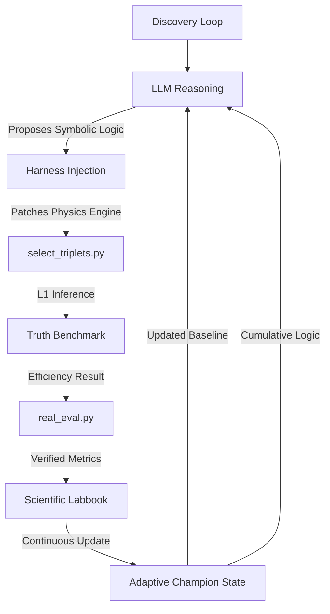

# Optimizing Hadronic Top-Quark Reconstruction using Physics-Informed Agentic Strategy Discovery

## 🔬 Project Overview
This project utilizes a custom autonomous discovery framework to optimize the reconstruction of hadronic top-quark decays ($t \to bW \to bjj$) in high-energy physics simulations. 

The primary challenge is **combinatorial background rejection**: in a multi-jet environment, the system must correctly identify which three jets originated from a single top quark. To meet the constraints of a **Level-1 (L1) Trigger**, any discovered selection logic must execute on an FPGA within an **<80ns latency budget**. Consequently, we prioritize **Symbolic Discovery** (handcrafted arithmetic) over deep neural networks.

## 🛠 Framework Architecture
The system utilizes an autonomous discovery loop epistemically isolated from raw data to prevent overfitting.

## 📊 Optimization Observables
The agent utilizes **14 distinct physics features** for every triplet candidate:
*   **Raw Classifier:** XGBoost BDT Score (Pre-trained on substructure).
*   **Global Triplet Scale:** Invariant Mass ($m_{123}$) and Transverse Momentum ($p_T$).
*   **Global Triplet position:** Detector coordinates ($\eta, \phi$).
*   **Resonant Sub-Masses:** $m_{ab}, m_{ac}, m_{bc}$ (Individual jet-pair invariant masses).
*   **Dimensionless Mass Ratios:** $m_{ab}/m_{123}, m_{ac}/m_{123}, m_{bc}/m_{123}$ (Targeting the 0.46 $W/Top$ signature).
*   **Angular Topology:** $\Delta R_{ab}, \Delta R_{ac}, \Delta R_{bc}$ (Jet-pair angular separations).

## 📈 Scientific Discovery Timeline
The search progressed through four distinct conceptual phases across **13,414 verified evaluations**:

| Phase | Goal | Breakthrough Strategy | Efficiency | Key Innovation |
| :--- | :--- | :--- | :--- | :--- |
| **I: Baseline** | Establish ML performance | `baseline_bdt` | 0.4340 | Pure BDT output without physics constraints. |
| **II: Kinematics** | Enforce Top resonance | `asymmetric_v3` | 0.6280 | Introduction of Asymmetric Gaussian mass priors. |
| **III: Topology** | Extract internal decay | `ratio_strat` | 0.5870 | Use of dimensionless ratios ($m_W/m_t$) to reject noise. |
| **IV: Cumulative** | Synergy & Refinement | `cumulative_v30k`| **0.6345** | Integration of $\eta$-position and ratio gating. |

## 🚀 Current Status: ACTIVE
- **Status:** **Hybrid Exploration Phase** (80% Refine / 20% Mutate)
- **Last Verified Best:** **0.6345 ± 0.015**
- **Actual Evaluations:** 13,414+
- **Search Iteration:** 60,000+ (Naming series)
- **Current Objective:** Balancing exploitation of the 0.63 champion with wild mutation exploration of angular asymmetries.

---
*Autonomous discovery performed on the LBL CBorg API cluster. Optimizing for real-time L1 Trigger environments.*
