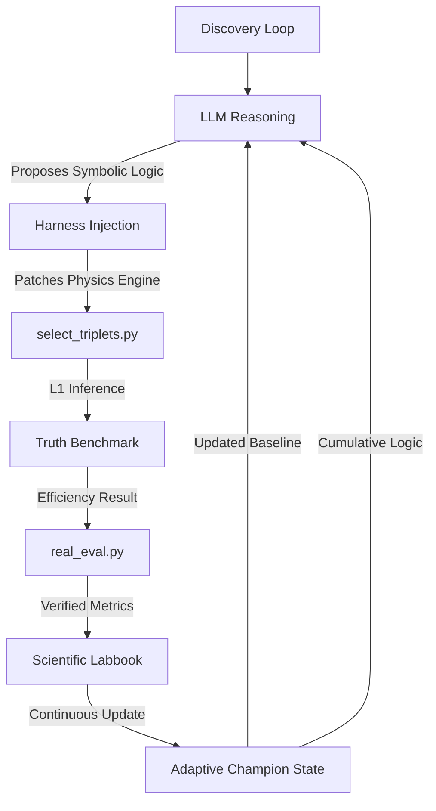

# Optimizing Hadronic Top-Quark Reconstruction using Physics-Informed Agentic Strategy Discovery

## 🔬 Project Overview
This project utilizes a custom autonomous discovery framework to optimize the reconstruction of hadronic top-quark decays ($t \to bW \to bjj$) in high-energy physics simulations. 

The primary challenge is **combinatorial background rejection**: in a multi-jet environment, the system must correctly identify which three jets originated from a single top quark. To meet the constraints of a **Level-1 (L1) Trigger**, any discovered selection logic must execute on an FPGA within an **<80ns latency budget**. Consequently, we prioritize **Symbolic Discovery** (handcrafted arithmetic) over deep neural networks.

## 🛠 Framework Architecture
The system utilizes an autonomous discovery loop (Harness v13.0) epistemically isolated from raw data to prevent overfitting.

## 📊 Optimization Observables
The agent has access to 15 kinematic and geometric features for every triplet candidate:
*   **XGBoost BDT Score:** A pre-trained substructure-aware classifier.
*   **Global Kinematics:** Triplet Invariant Mass ($m_{123}$), Triplet $p_T$, $\eta$, and $\phi$.
*   **Sub-Masses ($m_{ij}$):** Invariant masses of all three internal jet pairs (used to find the $W \to jj$ decay).
*   **Mass Fractions ($m_{ij}/m_{123}$):** Dimensionless ratios used to identify the $m_W/m_{top} \approx 0.46$ physical signature.
*   **Angular Topology ($\Delta R_{ij}$):** Angular separation between jet pairs to detect "boosted" (collimated) topologies.
*   **Detector Geometry ($\eta$):** Spatial position used to correct for resolution variations in forward vs. central regions.

## 📈 Scientific Discovery Timeline
The search progressed through four distinct conceptual phases:

| Phase | Goal | Breakthrough Strategy | Efficiency | Key Innovation |
| :--- | :--- | :--- | :--- | :--- |
| **I: Baseline** | Establish ML performance | `baseline_bdt` | 0.4340 | Pure BDT output without physics constraints. |
| **II: Kinematics** | Enforce Top resonance | `asymmetric_v3` | 0.6280 | Introduction of Asymmetric Gaussian mass priors. |
| **III: Topology** | Extract internal decay | `ratio_strat` | 0.5870 | Use of dimensionless ratios ($m_W/m_t$) to reject noise. |
| **IV: Cumulative** | Synergy & Refinement | `cumulative_v30k`| **0.6345** | Integration of $\eta$-position and ratio gating. |

### **Phase Details:**
1.  **Baseline Era:** Proved that pure ML is powerful but lacks the physical "anchors" needed to reject high-multiplicity backgrounds.
2.  **Kinematic Era:** Shifted focus to the 172.5 GeV mass peak. The agent discovered that a wider Gaussian tail on the low-mass side (due to radiation) significantly improved signal acceptance.
3.  **Topological Era:** Moved beyond the "whole top." The agent learned to "peer inside" the triplet to find the $W$-boson signature, allowing it to beat expert-designed mass windows.
4.  **Cumulative Era:** Switched to a self-updating "Champion State." The agent now takes the existing winner and discovers subtle multiplicative corrections (e.g., correcting the score for detector-resolution loss at high $|\eta|$).

## 🚀 Current Status: ACTIVE
- **Status:** **Adaptive Refinement Phase**
- **Last Verified Best:** **0.6345 ± 0.015**
- **Search Iteration:** 50,813+
- **Timestamp:** Sunday, April 19, 10:23 PM PDT
- **Current Objective:** Exploring non-linear interactions between triplet $p_T$ and detector $\eta$ to optimize selection in high-boost forward regions.

---
*Autonomous discovery performed on the LBL CBorg API cluster. Optimizing for real-time L1 Trigger environments.*
