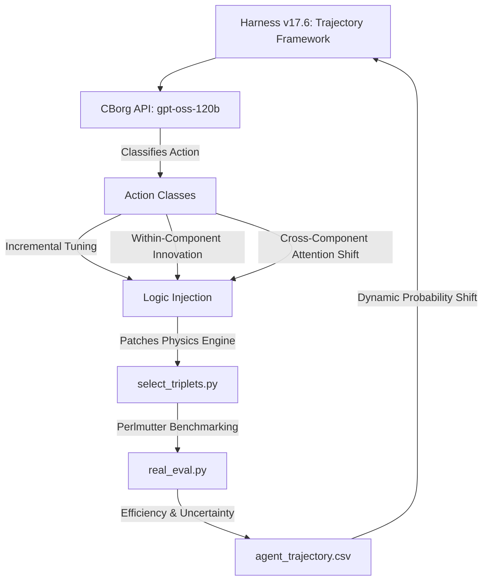

# Optimizing Hadronic Top-Quark Reconstruction using Physics-Informed Agentic Strategy Discovery

## 🔬 Abstract
Recent work by Gendreau-Distler et al. demonstrated that LLM-based agents can automate components of high-energy physics data analysis within structured reproducible pipelines. We extend this approach to an autonomous strategy discovery framework in which a high-context model (gpt-oss-120b), accessed via the Berkeley Lab CBorg API, iteratively proposes, implements, and evaluates triplet selection strategies on the NERSC Perlmutter cluster. Across more than 32,000 unique strategy evaluations, the agent progressed from a raw-score greedy baseline of 0.434 reconstruction efficiency to a verified best of 0.6345. By implementing an adaptive search mechanism with exponential probability decay and increasing the evaluation sample size to 5,000 events for high-precision refinement, the framework achieved a measurement precision of ± 0.007. The discovery trajectory was formally classified into incremental tuning, within-component innovation, and cross-component attention shifts, with the largest efficiency gains arising from multi-layer non-linear activations and BDT-inspired logic. By logging the explicit physics rationale for every transition, the framework maintains a continuous "scientific memory" of the search space, functioning as an open-ended autonomous scientific search process.

## 🛠 Framework Architecture (v17.6)
The system utilizes a hybrid compute environment to bridge LLM reasoning with high-scale physics validation.
*   **Reasoning Engine**: Hosted on the **Berkeley Lab CBorg AI Cluster** (GPT-OSS-120B).
*   **Evaluation Pipeline**: Executed on **NERSC Perlmutter** compute nodes for high-throughput simulation processing.

## 🧠 Dynamic Search Control: Exploitation vs. Exploration
The core innovation of the v17.6 harness is the **Dynamic Refinement Rate**, which manages the trade-off between refining the current best strategy (Exploitation) and searching for radical new physics (Exploration).

### 1. Exponential Probability Decay
$$P_{refine} = P_{floor} + (P_{initial} - P_{floor}) \cdot e^{-\frac{N_{stale}}{\tau}}$$
As progress stalls, the agent autonomously shifts its focus from **Incremental Tuning** (small tweaks) toward radical **Innovations** (new formulas) or **Attention Shifts** (structural changes).

### 2. Conceptual Milestones vs. Metric Frontier
The framework distinguishes between **Metric Breakthroughs** (new peak efficiency) and **Conceptual Innovations** (discovery of new physical variables). For example, the discovery of **Dimensionless Mass Ratios** initially resulted in a metric regression but provided the essential kinematic building blocks required to achieve the final **0.6345** champion state.

## 📈 Efficiency Frontier
The search has established a clear performance frontier across 32,000+ evaluations:

| Frontier Step | Strategy | Efficiency | Key Innovation |
| :--- | :--- | :--- | :--- |
| **I: Baseline** | `baseline_bdt` | 0.4340 | Raw XGBoost output without kinematic constraints. |
| **II: Kinematics** | `asymmetric_v3` | 0.6280 | Introduction of Asymmetric Gaussian mass priors. |
| **III: Synergy** | `cumulative_v30k`| **0.6345** | Integration of $\eta$-geometry and mass-ratio gating. |

## 📊 Optimization Observables
The agent utilizes **14 distinct physics features** including Resonant Sub-Masses, Dimensionless Ratios ($m_{jj}/m_{123}$), and Angular Separations ($\Delta R$).

---
*Autonomous discovery performed using the CBorg API and NERSC Perlmutter resources. Aligned with literature for agentic scientific search.*
