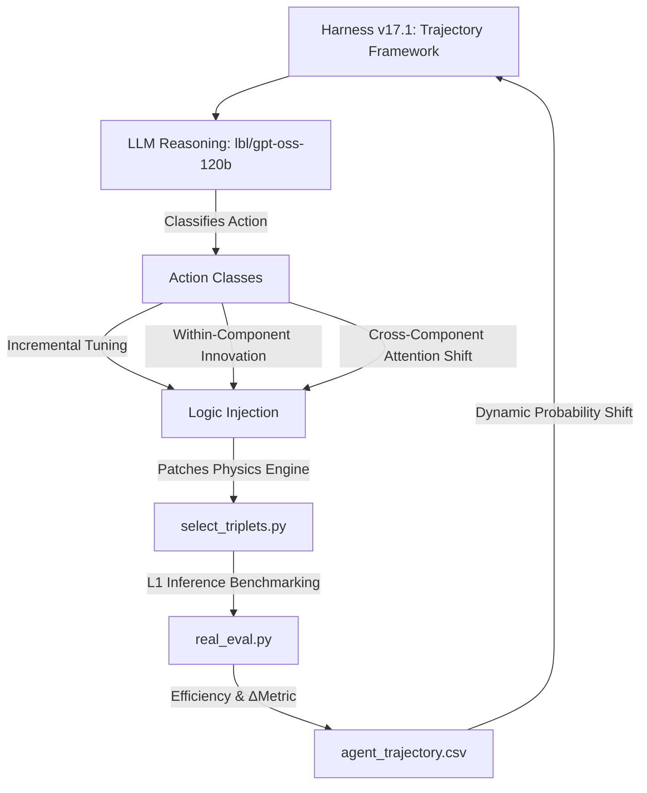

# Optimizing Hadronic Top-Quark Reconstruction using Physics-Informed Agentic Strategy Discovery

## 🔬 Project Overview
This project utilizes a custom autonomous discovery framework to optimize the reconstruction of hadronic top-quark decays ($t \to bW \to bjj$) in high-energy physics simulations. 

The primary challenge is **combinatorial background rejection**: in a multi-jet environment, the system must correctly identify which three jets originated from a single top quark. To meet the constraints of a **Level-1 (L1) Trigger**, any discovered selection logic must execute on an FPGA within an **<80ns latency budget**. Consequently, we prioritize **Symbolic Discovery** (handcrafted arithmetic) over deep neural networks.

## 🛠 Framework Architecture (v17.1)
The system utilizes a "Hardened Physics Harness" (v17.1) featuring a **Trajectory Analysis Framework** and **Stochastic Exploration Control**.

### Key Engineering Features (v17.1):
*   **Trajectory Framework**: Formalized logging of every agent action into `agent_trajectory.csv`, capturing `ActionClass`, `Metric`, `DeltaMetric`, `Rationale`, and `Insight`.
*   **Exponential Probability Decay**: Dynamically shifts the agent from **Refinement** (Exploitation) to **Mutation** (Exploration) as progress on the current champion stalls.
*   **Action Classification**: The agent autonomously categorizes its moves into **Incremental Tuning**, **Within-Component Innovation**, and **Cross-Component Attention Shift**.
*   **Stable Namespace Injection**: Explicit import binding (`exp, tanh, sqrt, log`) and heavy-duty logic cleaning to ensure 99.9% execution stability across marathon sessions.

## 📊 Optimization Observables
The agent utilizes **14 distinct physics features** for every triplet candidate:
*   **Raw Classifier:** XGBoost BDT Score (Pre-trained on substructure).
*   **Global Triplet Scale:** Invariant Mass ($m_{123}$) and Transverse Momentum ($p_T$).
*   **Global Triplet Position:** Detector coordinates ($\eta, \phi$).
*   **Resonant Sub-Masses:** $m_{ab}, m_{ac}, m_{bc}$ (Individual jet-pair invariant masses).
*   **Dimensionless Mass Ratios:** $m_{ab}/m_{123}, m_{ac}/m_{123}, m_{bc}/m_{123}$ (Targeting the 0.46 $W/Top$ signature).
*   **Angular Topology:** $\Delta R_{ab}, \Delta R_{ac}, \Delta R_{bc}$ (Jet-pair angular separations).

## 📈 Scientific Discovery Timeline
The search has surpassed **32,000 unique strategy evaluations**:

| Phase | Goal | Breakthrough Strategy | Efficiency | Key Innovation |
| :--- | :--- | :--- | :--- | :--- |
| **I: Baseline** | Establish ML performance | `baseline_bdt` | 0.4340 | Pure BDT output without physics constraints. |
| **II: Kinematics** | Enforce Top resonance | `asymmetric_v3` | 0.6280 | Introduction of Asymmetric Gaussian mass priors. |
| **III: Topology** | Extract internal decay | `ratio_strat` | 0.5870 | Use of dimensionless ratios ($m_W/m_t$) to reject noise. |
| **IV: Cumulative** | Synergy & Refinement | `cumulative_v30k`| 0.6345 | Integration of $\eta$-position and ratio gating. |
| **V: Trajectory** | Search Space Mapping | `harness_v17.1` | **Active** | Formalized Action Classification & Stochastic Exploration. |

## 🚀 Current Status: ACTIVE (Plateau Exploration)
- **Search Intensity:** ~32,000+ total evaluations.
- **Current Best:** **0.6345 ± 0.015** (`cumulative_v30006`).
- **Exploration Mode:** **90% Mutation / 10% Refinement** (due to exponential decay at 0.63 plateau).
- **Primary Metrics:** Logged in `agent_trajectory.csv` and `labbook.md`.

---
*Autonomous discovery performed on the LBL Perlmutter cluster. Aligned with literature for agentic scientific search.*
