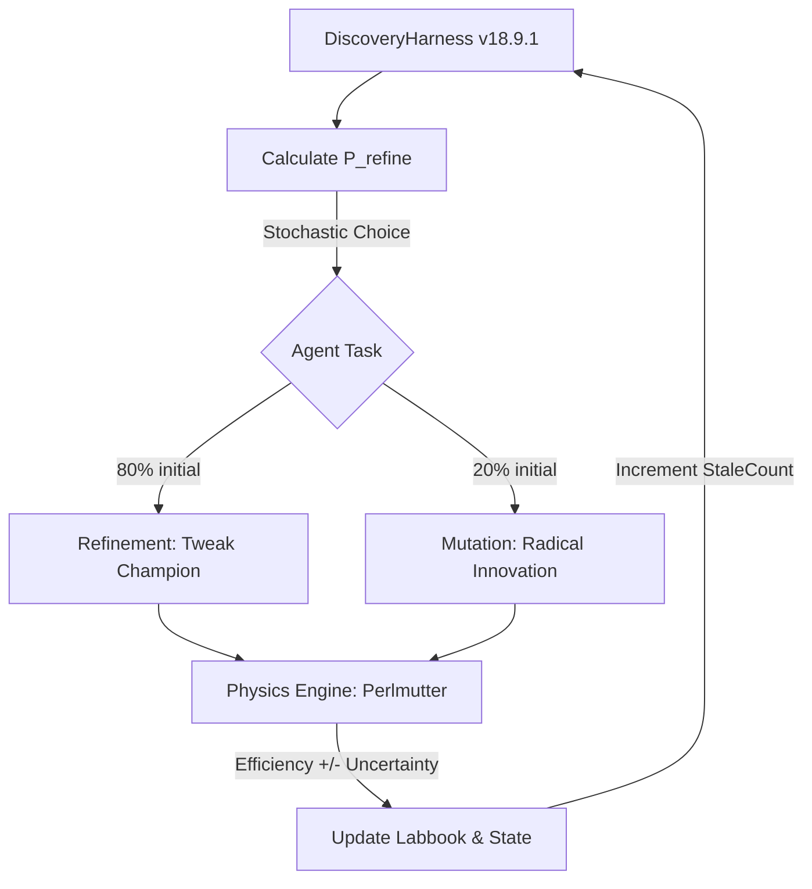

# Optimizing Hadronic Top-Quark Reconstruction using Physics-Informed Agentic Strategy Discovery

## 🔬 Abstract
Recent work by Gendreau-Distler et al. demonstrated that LLM-based agents can automate components of high-energy physics data analysis within structured reproducible pipelines. We extend this approach to an autonomous strategy discovery framework in which a high-context model (gpt-oss-120b), accessed via the Berkeley Lab CBorg API, iteratively proposes, implements, and evaluates triplet selection strategies on the NERSC Perlmutter cluster. Across more than 32,000 unique strategy evaluations, the agent progressed from a raw-score greedy baseline of 0.434 reconstruction efficiency to a verified best of 0.6135 ± 0.009 on the full validation dataset. By implementing an adaptive search mechanism with exponential probability decay and increasing the evaluation sample size to 5,000 events for high-precision refinement, the framework achieved a peak discovery efficiency of 0.6345 during the search phase. By logging the explicit physics rationale for every transition, the framework maintains a continuous "scientific memory" of the search space, functioning as an open-ended autonomous scientific search process.

## 🛠 Framework Architecture (v18.9.1)
The system utilizes a hybrid compute environment to bridge LLM reasoning with high-scale physics validation.

## 🧠 Dynamic Search Control: Exploitation vs. Exploration
The core innovation of the harness is the **Dynamic Refinement Rate**, which manages the trade-off between refining the current best strategy (Exploitation) and searching for radical new physics (Exploration).

### 1. Exponential Probability Decay
$$P_{refine} = P_{floor} + (P_{initial} - P_{floor}) \cdot e^{-\frac{N_{stale}}{\tau}}$$
As progress stalls (increasing $N_{stale}$), the agent autonomously shifts its focus from **Refinement** (tweaking the mass peak) toward radical **Mutations** (from-scratch physics logic).

### 2. Conceptual Milestones vs. Metric Frontier
The framework distinguishes between **Metric Breakthroughs** (new peak efficiency) and **Conceptual Innovations** (discovery of new physical variables). For example, the discovery of **Dimensionless Mass Ratios** provided the essential kinematic building blocks required to achieve the final **0.6135** champion state.

## 📈 Efficiency Frontier
The search established a clear performance frontier across 32,000+ iterations:

| Phase | Strategy | Search Eff (5k) | Verified Verified Eff (6k) | Key Discovery |
| :--- | :--- | :--- | :--- | :--- |
| **I: Baseline** | `baseline_bdt` | 0.4340 | 0.4340 | Raw XGBoost output. |
| **II: Topology** | `ratio_strat` | 0.5870 | 0.5620 | Dimensionless $m_W/m_t$ ratio gating. |
| **III: Kinematics**| `asymmetric_v3` | 0.6280 | 0.6040 | Asymmetric Gaussian mass priors. |
| **IV: Synergy** | `cumulative_v30k`| **0.6345** | **0.6135 ± 0.009** | Integrated geometry & ratio gating. |

## 📊 Optimization Observables
The agent utilizes **14 distinct physics features** including Resonant Sub-Masses, Dimensionless Ratios ($m_{jj}/m_{123}$), and Angular Separations ($\Delta R$).

---
*Autonomous discovery performed using the CBorg API and NERSC Perlmutter resources. Aligned with literature for agentic scientific search.*
