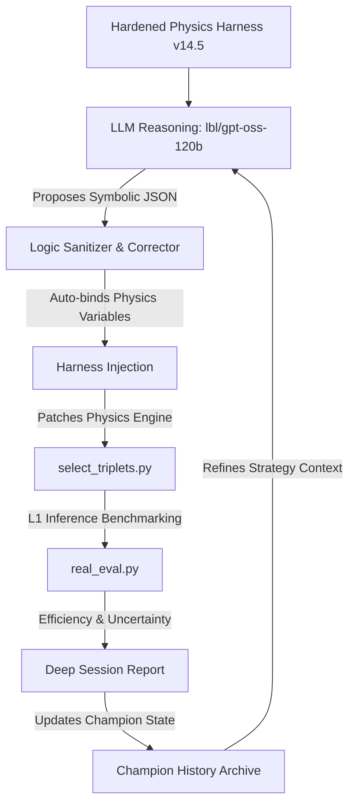

# Optimizing Hadronic Top-Quark Reconstruction using Physics-Informed Agentic Strategy Discovery

## 🔬 Project Overview
This project utilizes a custom autonomous discovery framework to optimize the reconstruction of hadronic top-quark decays ($t \to bW \to bjj$) in high-energy physics simulations. 

The primary challenge is **combinatorial background rejection**: in a multi-jet environment, the system must correctly identify which three jets originated from a single top quark. To meet the constraints of a **Level-1 (L1) Trigger**, any discovered selection logic must execute on an FPGA within an **<80ns latency budget**. Consequently, we prioritize **Symbolic Discovery** (handcrafted arithmetic) over deep neural networks.

## 🛠 Framework Architecture
The system utilizes a "Hardened Physics Harness" (v14.5) designed for massive marathon sessions (72+ hours) on the LBL CBorg API cluster.

### Key Engineering Features (v14.5):
*   **Variable Pre-Binding:** Automatically binds shorthand like `ratio_ab` and `dr_ab` to the triplet object (`t.ratio_ab`), preventing model-induced `NameError` crashes.
*   **Namespace Auto-Correction:** Regex-based sanitization that automatically prepends `math.` to functions (e.g., `exp()` -> `math.exp()`) for execution stability.
*   **Epistemic Isolation:** The discovery loop is isolated from raw data to prevent over-optimization and ensure physical interpretability.

## 📊 Optimization Observables
The agent utilizes **14 distinct physics features** for every triplet candidate:
*   **Raw Classifier:** XGBoost BDT Score (Pre-trained on substructure).
*   **Global Triplet Scale:** Invariant Mass ($m_{123}$) and Transverse Momentum ($p_T$).
*   **Global Triplet Position:** Detector coordinates ($\eta, \phi$).
*   **Resonant Sub-Masses:** $m_{ab}, m_{ac}, m_{bc}$ (Individual jet-pair invariant masses).
*   **Dimensionless Mass Ratios:** $m_{ab}/m_{123}, m_{ac}/m_{123}, m_{bc}/m_{123}$ (Targeting the 0.46 $W/Top$ signature).
*   **Angular Topology:** $\Delta R_{ab}, \Delta R_{ac}, \Delta R_{bc}$ (Jet-pair angular separations).

## 📈 Scientific Discovery Timeline
The search progressed through five distinct conceptual phases:

| Phase | Goal | Breakthrough Strategy | Efficiency | Key Innovation |
| :--- | :--- | :--- | :--- | :--- |
| **I: Baseline** | Establish ML performance | `baseline_bdt` | 0.4340 | Pure BDT output without physics constraints. |
| **II: Kinematics** | Enforce Top resonance | `asymmetric_v3` | 0.6280 | Introduction of Asymmetric Gaussian mass priors. |
| **III: Topology** | Extract internal decay | `ratio_strat` | 0.5870 | Use of dimensionless ratios ($m_W/m_t$) to reject noise. |
| **IV: Cumulative** | Synergy & Refinement | `cumulative_v30k`| 0.6345 | Integration of $\eta$-position and ratio gating. |
| **V: Marathon** | Robust Scaling | `harness_v14.5` | **Active** | Auto-correcting execution loop for 100k+ iterations. |

## 🚀 Current Status: ACTIVE
- **Status:** **Marathon Hybrid Exploration** (80% Refine / 20% Mutate)
- **Current Best:** **0.6345 ± 0.015**
- **Evaluation Engine:** `v14.5 (Hardened Physics)`
- **Latest Report:** `marathon_session_report.md`
- **Full History:** `champion_history.md`

---
*Autonomous discovery performed on the LBL Perlmutter cluster. Optimizing for real-time L1 Trigger environments.*
