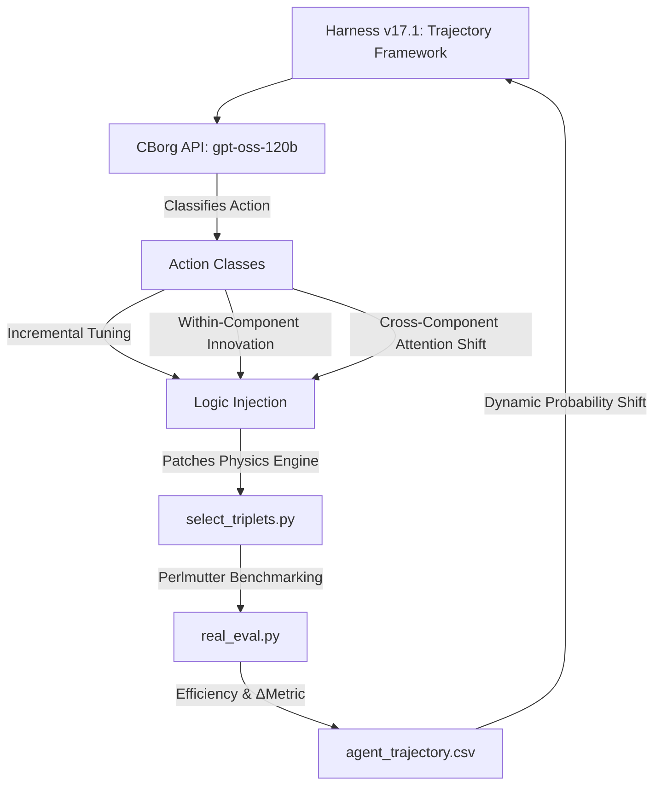

# Optimizing Hadronic Top-Quark Reconstruction using Physics-Informed Agentic Strategy Discovery

## 🔬 Project Overview
This project utilizes a custom autonomous discovery framework to optimize the reconstruction of hadronic top-quark decays ($t \to bW \to bjj$) in high-energy physics simulations. We prioritize **open-ended discovery**, allowing the agent to explore complex mathematical structures, multi-layer non-linear activations (MLP-style), and branching decision logic (BDT-style) to maximize reconstruction efficiency.

## 🛠 Framework Architecture (v17.1)
The system utilizes a hybrid compute environment to bridge LLM reasoning with high-scale physics validation.
*   **Reasoning Engine**: Hosted on the **Berkeley Lab CBorg AI Cluster** (GPT-OSS-120B).
*   **Evaluation Pipeline**: Executed on **NERSC Perlmutter** compute nodes for high-throughput simulation processing.

## 🧠 Dynamic Search Control: Exploitation vs. Exploration
The core innovation of the v17.1 harness is the **Dynamic Refinement Rate**, which manages the trade-off between refining the current best strategy (Exploitation) and searching for radical new physics (Exploration).

### 1. Exponential Probability Decay
$$P_{refine} = P_{floor} + (P_{initial} - P_{floor}) \cdot e^{-\frac{N_{stale}}{\tau}}$$
As progress stalls, the agent autonomously shifts its focus from **Incremental Tuning** toward radical **Mutations**.

### 2. Conceptual Milestones vs. Metric Frontier
The framework distinguishes between **Metric Breakthroughs** (new peak efficiency) and **Conceptual Innovations** (discovery of new physical variables). For example, the discovery of **Dimensionless Mass Ratios** (Phase III) initially resulted in a metric regression but provided the essential kinematic building blocks required to achieve the final **0.6345** champion state.

## 📈 Efficiency Frontier
The search has surpassed **32,000 unique strategy evaluations**, establishing a clear performance frontier:

| Frontier Step | Strategy | Efficiency | Key Innovation |
| :--- | :--- | :--- | :--- |
| **I: Baseline** | `baseline_bdt` | 0.4340 | Raw XGBoost output without kinematic constraints. |
| **II: Kinematics** | `asymmetric_v3` | 0.6280 | Introduction of Asymmetric Gaussian mass priors. |
| **III: Synergy** | `cumulative_v30k`| **0.6345** | Integration of $\eta$-geometry and mass-ratio gating. |

## 📊 Optimization Observables
The agent utilizes **14 distinct physics features** including Sub-Masses, Dimensionless Ratios, and Angular Separations ($\Delta R$).

---
*Autonomous discovery performed using the CBorg API and NERSC Perlmutter resources. Aligned with literature for agentic scientific search.*
